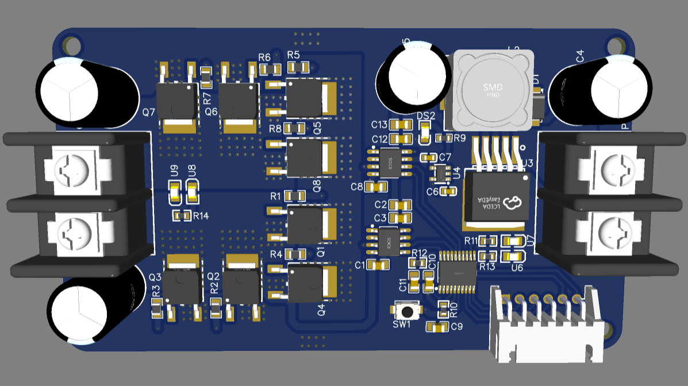
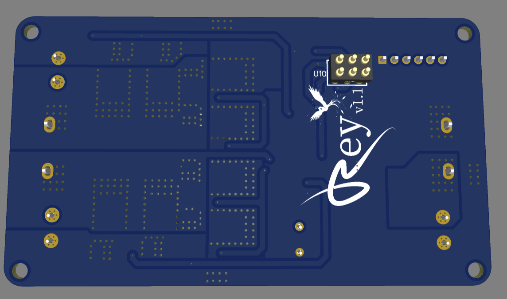
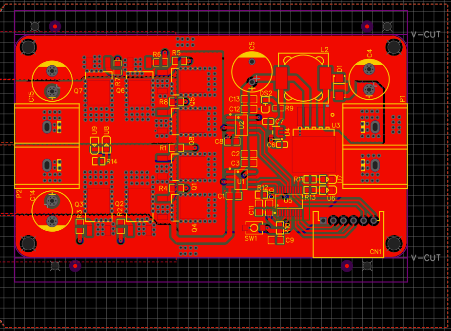
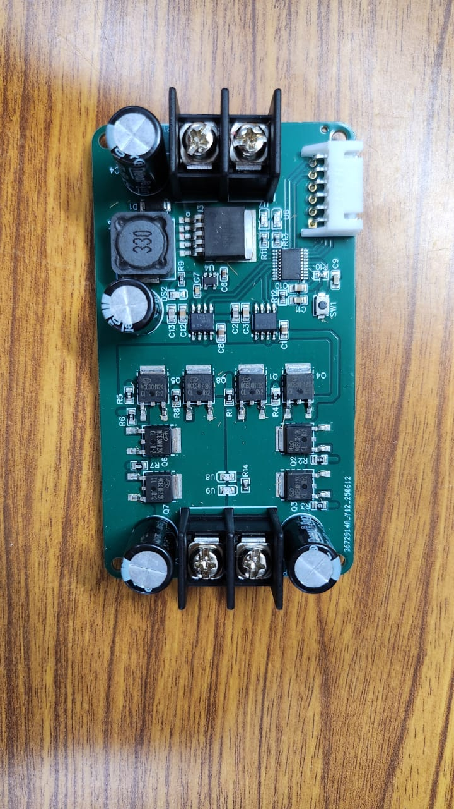
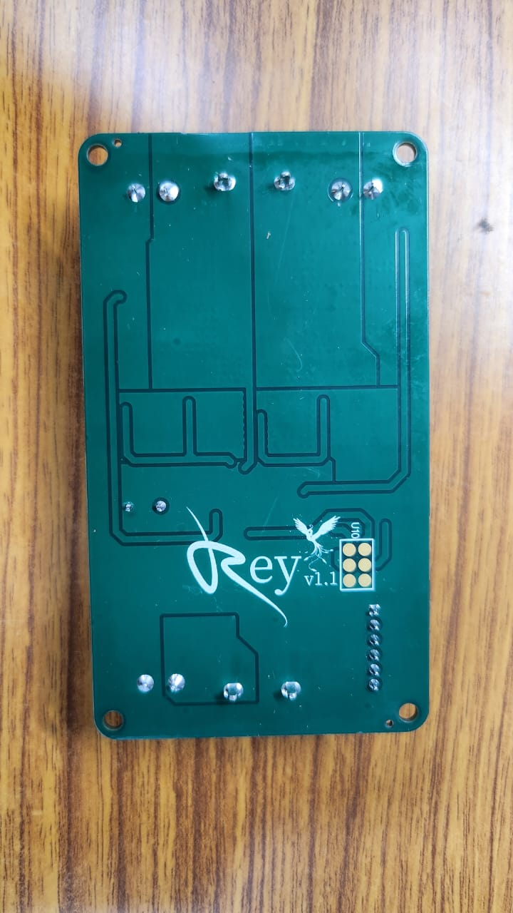
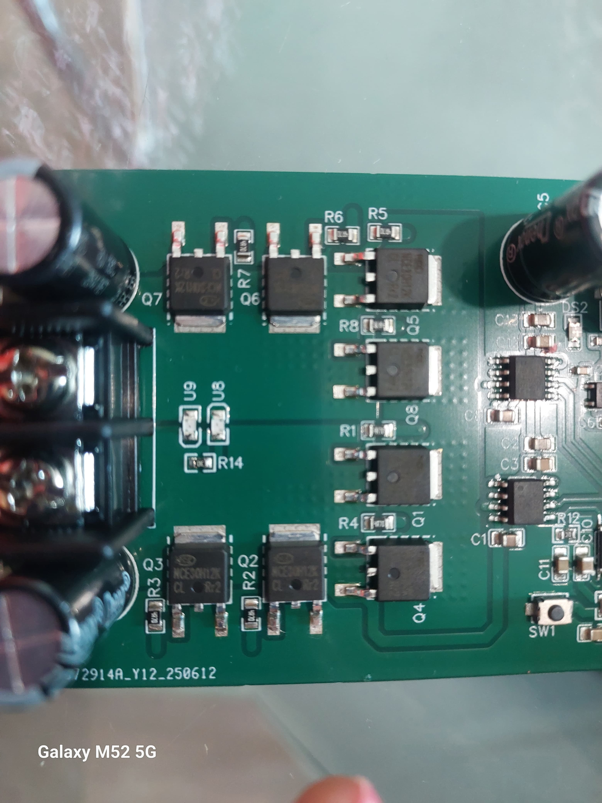

# Smart DC Motor Controller (STM32F030 Based)

A high-performance, smart DC motor controller designed using the STM32F030 microcontroller. This board supports trajectory generation, position and velocity control using cascaded loops, and interfaces through UART and analog pins. It offers robust performance with support for high current applications and is ideal for robotics and precision motion systems.

---

## 🚀 Features

- ✅ **Microcontroller**: STM32F030 (ARM Cortex-M0)
- ✅ **Control Modes**:
  - Cascaded PID control loops (position & velocity)
  - Trajectory generation and tracking
- ✅ **Inputs**:
  - Encoder (quadrature)
  - PWM
  - Direction signal
  - UART command interface
- ✅ **Communication**:
  - UART
  - Analog input
- ✅ **Output**:
  - PWM for DC motor control
- ✅ **Smart Functions**:
  - Joystick-based trajectory demo
  - Safety features and error feedback
- ✅ **Power Specs**:
  - Voltage: 12V – 36V
  - Current: Up to 50 Amps

---

## 📷 Hardware Gallery

### 🔧 3D CAD Model

| Lateral View 1 | Lateral View 2 | Lateral View 3 |
|----------------|----------------|----------------|
|  |  |  |

### 📦 PCB Production
 

| Assembled Front | Assembled Back |
|-----------------|----------------|
|  |  |

---

## 🎮 Live Demo

Watch a live demonstration of the controller operating a DC motor using a joystick input.

> Replace the link above with your actual YouTube or MP4 demo URL.

---

